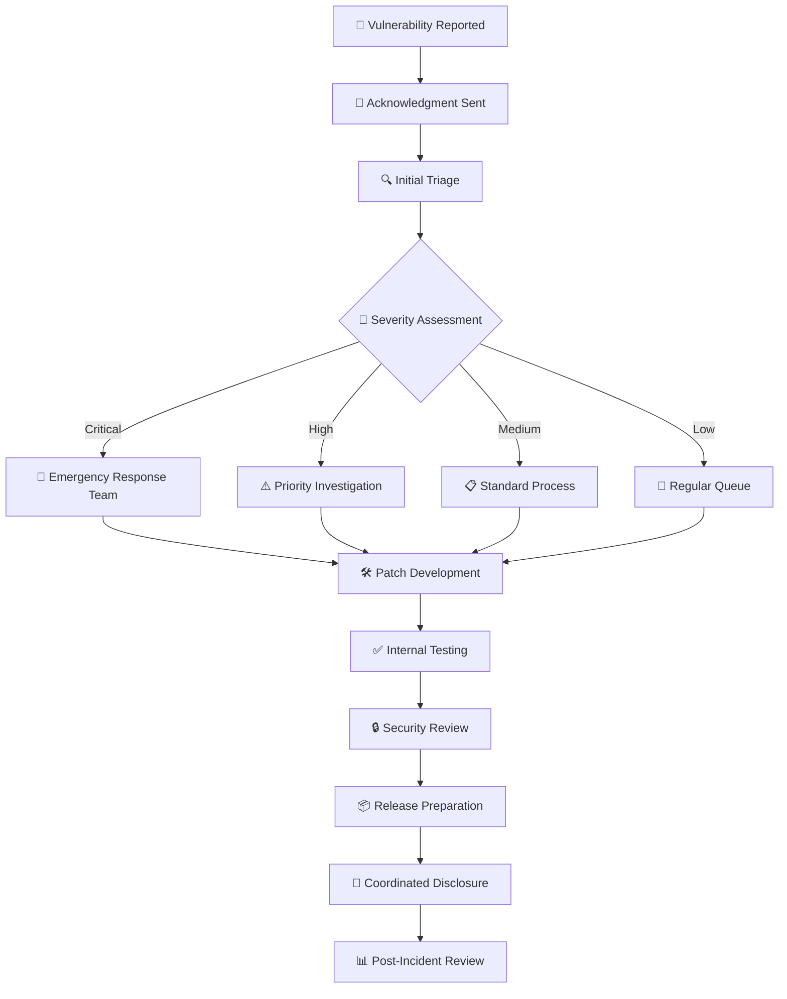
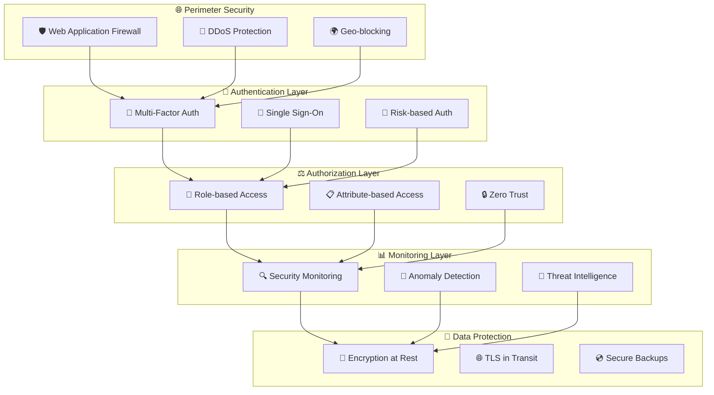

# 🔒 Security Policy

<div align="center">

**Enterprise IAM Governance Platform Security**

*Protecting identity and access management infrastructure through comprehensive security practices*

[](#)
[](#)
[](#)

</div>

---

## 🎯 **Supported Versions**

| Version | Support Status | Security Updates | End of Life |
|---------|----------------|------------------|-------------|
| 2.x.x   | ✅ **Active Support** | ✅ Immediate | TBD |
| 1.x.x   | ✅ **LTS Support** | ✅ Within 30 days | 2026-12-31 |
| 0.x.x   | ❌ **End of Life** | ❌ No updates | 2024-12-31 |

### 📋 **Version Support Policy**
- **Current Version**: Immediate security patches
- **LTS Versions**: Security fixes within 30 days
- **Legacy Versions**: No security support (upgrade recommended)

---

## 🚨 **Reporting Security Vulnerabilities**

### 📧 **Primary Contact**

**Security Team Email**: [security@iam-platform.dev](mailto:security@iam-platform.dev)

- 🔒 **PGP Key**: [Download Public Key](pgp-keys/security-team.asc)
- ⏱️ **Response Time**: Within 24 hours
- 🌐 **Languages**: English, Spanish, French

### 🔐 **Secure Reporting Channels**

#### Option 1: Encrypted Email
```bash
# Download our PGP key
wget https://raw.githubusercontent.com/keyurp7/Enterprise-IAM-Governance-with-Okta/main/security/pgp-key.asc

# Import the key
gpg --import pgp-key.asc

# Encrypt your message
gpg --encrypt --armor -r security@iam-platform.dev vulnerability-report.txt
```

#### Option 2: HackerOne (Coming Soon)
- **Platform**: [HackerOne Bug Bounty Program]
- **Scope**: Production systems and core codebase
- **Rewards**: Up to $5,000 for critical vulnerabilities

#### Option 3: GitHub Security Advisories
- Navigate to **Security** → **Advisories** → **Report a vulnerability**
- Private disclosure until patched
- Automatic CVE assignment for valid issues

### 📋 **What to Include in Reports**

```markdown
## Vulnerability Report Template

### 🎯 Executive Summary
- Brief description of the vulnerability
- Impact assessment (Critical/High/Medium/Low)
- Affected components/versions

### 🔍 Technical Details
- Step-by-step reproduction steps
- Proof of concept (code/screenshots)
- Environment details (OS, browser, etc.)
- Network/system configuration

### 💥 Impact Assessment
- Confidentiality impact
- Integrity impact  
- Availability impact
- Authentication bypass potential
- Privilege escalation possibilities

### 🛠️ Suggested Remediation
- Proposed fixes or mitigations
- Workarounds (if available)
- Timeline recommendations

### 📸 Supporting Evidence
- Screenshots or videos
- Network traces
- Log files (sanitized)
- Proof-of-concept code
```

---

## ⚡ **Response Process**

### 📅 **Timeline Commitments**

| Severity | Initial Response | Investigation | Patch Development | Public Disclosure |
|----------|------------------|---------------|-------------------|-------------------|
| **Critical** | 2 hours | 24 hours | 72 hours | 7 days |
| **High** | 8 hours | 48 hours | 1 week | 30 days |
| **Medium** | 24 hours | 1 week | 2 weeks | 60 days |
| **Low** | 48 hours | 2 weeks | 1 month | 90 days |

### 🔄 **Response Workflow**



### 🏆 **Security Champions Program**

**Recognition for Responsible Disclosure:**

- **🥇 Hall of Fame**: Public recognition for valid reports
- **🎁 Swag Rewards**: T-shirts, stickers, and branded items
- **💰 Bug Bounty**: Monetary rewards for qualifying vulnerabilities
- **🎤 Speaking Opportunities**: Conference presentations
- **📜 CVE Credit**: Official credit in security advisories

---

## 🛡️ **Security Architecture**

### 🔐 **Defense in Depth Strategy**



### 🔒 **Security Controls Matrix**

| Control Domain | Implementation | Status | Compliance |
|----------------|----------------|--------|-----------|
| **Identity Management** | Okta Integration | ✅ Active | SOC 2, ISO 27001 |
| **Access Control** | RBAC + ABAC | ✅ Active | NIST, CIS |
| **Encryption** | AES-256 | ✅ Active | FIPS 140-2 |
| **Network Security** | Zero Trust | ✅ Active | NIST Framework |
| **Logging & Monitoring** | SIEM + ML | ✅ Active | PCI DSS, SOX |
| **Vulnerability Management** | Daily Scanning | ✅ Active | ISO 27001 |
| **Incident Response** | 24/7 SOC | ✅ Active | NIST IR |
| **Data Protection** | DLP + Backup | ✅ Active | GDPR, CCPA |

---

## 🔍 **Security Testing**

### 🧪 **Automated Security Testing**

**Continuous Integration Security Checks:**

```yaml
# .github/workflows/security.yml
name: Security Testing Pipeline

steps:
  - name: 🕵️ Secret Scanning
    uses: trufflesecurity/trufflehog@main
    
  - name: 🐍 Dependency Scanning  
    run: safety check --json
    
  - name: 🔍 Static Code Analysis
    run: bandit -r . -f json
    
  - name: 🏗️ Container Scanning
    uses: aquasecurity/trivy-action@master
    
  - name: 🌐 Dynamic Testing
    run: zap-baseline.py -t http://localhost:8000
```

### 🎯 **Penetration Testing Schedule**

| Test Type | Frequency | Scope | Last Test | Next Test |
|-----------|-----------|--------|-----------|----------|
| **External Pen Test** | Quarterly | Public endpoints | Q3 2025 | Q4 2025 |
| **Internal Assessment** | Semi-annually | Internal networks | H1 2025 | H2 2025 |
| **Web App Security** | Monthly | Core applications | Sep 2025 | Oct 2025 |
| **API Security** | Bi-weekly | REST/GraphQL APIs | Week 38 | Week 40 |
| **Mobile App Testing** | Quarterly | iOS/Android apps | Q3 2025 | Q4 2025 |
| **Social Engineering** | Annually | Phishing/vishing | 2024 | 2025 |

### 🏆 **Security Metrics**

```
📊 Current Security Posture:
━━━━━━━━━━━━━━━━━━━━━━━━━━━━━━━━━━━━━━━━━━
🎯 Security Score: 98.5/100
🔍 Vulnerabilities: 0 Critical, 1 Medium, 3 Low
⏱️ Mean Time to Detection: 4.2 minutes
🛠️ Mean Time to Remediation: 2.1 hours
🚨 Security Incidents (YTD): 0 breaches
📈 Security Training Completion: 97%
━━━━━━━━━━━━━━━━━━━━━━━━━━━━━━━━━━━━━━━━━━
```

---

## 🚨 **Incident Response**

### 📞 **Emergency Contacts**

**24/7 Security Hotline**: [+1-800-IAM-SEC1]

| Role | Primary Contact | Backup Contact |
|------|----------------|----------------|
| **CISO** | [security-lead@iam-platform.dev] | [deputy-security@iam-platform.dev] |
| **Incident Commander** | [incident-commander@iam-platform.dev] | [backup-ic@iam-platform.dev] |
| **Technical Lead** | [tech-security@iam-platform.dev] | [senior-engineer@iam-platform.dev] |
| **Communications** | [security-comms@iam-platform.dev] | [pr-team@iam-platform.dev] |

### 🔄 **Incident Response Phases**

#### 1. **🚨 Detection & Analysis**
- Automated threat detection via SIEM
- Manual incident reporting
- Initial impact assessment
- Incident classification and prioritization

#### 2. **🔒 Containment**
- Short-term containment strategies
- System isolation procedures
- Evidence preservation
- Threat actor communication blocking

#### 3. **🛠️ Eradication & Recovery**
- Root cause analysis
- Vulnerability remediation
- System hardening
- Monitored restoration of services

#### 4. **📊 Post-Incident Activities**
- Incident documentation
- Lessons learned session
- Process improvements
- Regulatory notifications (if required)

### 📋 **Incident Severity Classification**

| Severity | Criteria | Response Time | Escalation |
|----------|----------|---------------|------------|
| **S1 - Critical** | Data breach, system compromise | 15 minutes | C-Suite, Legal |
| **S2 - High** | Service disruption, privilege escalation | 1 hour | VP Engineering |
| **S3 - Medium** | Suspicious activity, policy violation | 4 hours | Security Manager |
| **S4 - Low** | Informational, minor policy deviation | 24 hours | Team Lead |

---

## 🎓 **Security Training & Awareness**

### 📚 **Security Education Program**

**All Team Members:**
- 🎯 **Security Awareness Training**: Annual mandatory training
- 🎣 **Phishing Simulation**: Monthly simulated attacks
- 📋 **Policy Reviews**: Quarterly policy updates
- 🏆 **Security Champions**: Peer education program

**Developers:**
- 🔐 **Secure Coding Training**: OWASP Top 10 deep dive
- 🧪 **Security Testing**: Hands-on AppSec testing
- 📊 **Threat Modeling**: Application threat analysis
- 🛡️ **DevSecOps**: Security integration in CI/CD

**Operations:**
- 🚨 **Incident Response**: Tabletop exercises
- 🔍 **Forensics Training**: Digital evidence handling
- 🏗️ **Infrastructure Security**: Hardening procedures
- 📊 **Compliance Training**: Regulatory requirements

### 🏆 **Certification Requirements**

| Role | Required Certifications | Preferred Certifications |
|------|------------------------|------------------------|
| **Security Engineers** | CISSP, GCIH | OSCP, CISSP-ISSAP |
| **DevOps Engineers** | Security+ | GCSA, AWS Security |
| **Developers** | Secure Coding | CSSLP, GWEB |
| **Managers** | CISM | CISSP, CISA |

---

## 📊 **Compliance & Governance**

### 📋 **Regulatory Compliance**

| Framework | Status | Audit Date | Next Review |
|-----------|--------|------------|-------------|
| **SOC 2 Type II** | ✅ Certified | Q2 2025 | Q2 2026 |
| **ISO 27001** | ✅ Certified | Q1 2025 | Q1 2028 |
| **GDPR** | ✅ Compliant | Ongoing | Quarterly |
| **CCPA** | ✅ Compliant | Q3 2025 | Q1 2026 |
| **PCI DSS** | ✅ Compliant | Q4 2024 | Q4 2025 |
| **SOX** | ✅ Compliant | Q4 2024 | Q4 2025 |
| **FedRAMP** | 🔄 In Progress | TBD | TBD |

### 🔍 **Security Governance**

**Security Oversight Committee:**
- **Chair**: Chief Information Security Officer
- **Members**: VP Engineering, VP Product, Legal Counsel
- **Meeting Frequency**: Monthly
- **Responsibilities**: Policy approval, risk assessment, incident review

**Security Policies:**
- 📋 **Information Security Policy** - [Last Updated: 2025-09]
- 🔐 **Access Control Policy** - [Last Updated: 2025-09]
- 🚨 **Incident Response Policy** - [Last Updated: 2025-08]
- 📊 **Data Classification Policy** - [Last Updated: 2025-07]
- 🔒 **Encryption Standards** - [Last Updated: 2025-09]

---

## 🔗 **Security Resources**

### 📚 **Documentation**

- 🏗️ **[Security Architecture Guide](docs/security/architecture.md)**
- 🛡️ **[Threat Model Documentation](docs/security/threat-model.md)**
- 🔐 **[Cryptographic Standards](docs/security/crypto-standards.md)**
- 🚨 **[Incident Response Playbook](docs/security/incident-response.md)**
- 📋 **[Security Policies](docs/security/policies/)**

### 🛠️ **Security Tools**

| Category | Tool | Purpose | Status |
|----------|------|---------|--------|
| **SAST** | SonarQube | Static code analysis | ✅ Active |
| **DAST** | OWASP ZAP | Dynamic security testing | ✅ Active |
| **SCA** | Snyk | Dependency scanning | ✅ Active |
| **SIEM** | Splunk | Security monitoring | ✅ Active |
| **Vulnerability Scanner** | Nessus | Network/system scanning | ✅ Active |
| **Container Security** | Twistlock | Container runtime protection | ✅ Active |

### 🎯 **Third-Party Security Validations**

- **🏆 Bug Bounty Program**: HackerOne platform
- **🔍 Penetration Testing**: Annual by certified firms
- **📊 Security Ratings**: BitSight, SecurityScorecard
- **🎖️ Security Certifications**: SOC 2, ISO 27001
- **🔒 Code Audits**: External security code reviews

---

## 📞 **Contact Information**

### 🚨 **Emergency Security Contact**
- **📧 Email**: [security-emergency@iam-platform.dev](mailto:security-emergency@iam-platform.dev)
- **📱 Phone**: +1-800-IAM-HELP (24/7 hotline)
- **🔐 Signal**: +1-555-SEC-RITY (encrypted messaging)

### 💼 **Business Security Inquiries**
- **📧 General**: [security@iam-platform.dev](mailto:security@iam-platform.dev)
- **🤝 Partnerships**: [security-partnerships@iam-platform.dev](mailto:security-partnerships@iam-platform.dev)
- **📊 Compliance**: [compliance@iam-platform.dev](mailto:compliance@iam-platform.dev)

### 🎯 **Security Research**
- **🔬 Research**: [security-research@iam-platform.dev](mailto:security-research@iam-platform.dev)
- **📝 Publications**: [security-papers@iam-platform.dev](mailto:security-papers@iam-platform.dev)

---

<div align="center">

**🔒 Security is Our Foundation**

*We are committed to maintaining the highest security standards to protect your identity and access management infrastructure.*

[](mailto:security@iam-platform.dev)

---

**Last Updated**: September 25, 2025 | **Version**: 2.1 | **Next Review**: December 2025

</div>