# 🏗️ Enterprise IAM Platform Architecture

## 🎯 **Architecture Overview**

The Enterprise IAM Governance Platform follows a modern, cloud-native microservices architecture designed for scalability, security, and maintainability.

```mermaid
graph TB
    subgraph "🌐 Client Layer"
        WEB["🖥️ Web Dashboard"]
        MOBILE["📱 Mobile App"]
        API_CLIENT["🔌 API Clients"]
    end
    
    subgraph "🚪 API Gateway Layer"
        GATEWAY["⚡ API Gateway"]
        LB["⚖️ Load Balancer"]
        WAF["🛡️ Web Application Firewall"]
    end
    
    subgraph "🔐 Security Layer"
        AUTH["🔑 Authentication Service"]
        AUTHZ["🎫 Authorization Service"]
        JWT["🎟️ JWT Token Manager"]
        MFA["📲 MFA Service"]
    end
    
    subgraph "⚙️ Core Services"
        USER["👥 User Management"]
        GROUP["👨‍👩‍👧‍👦 Group Management"]
        POLICY["📋 Policy Engine"]
        WORKFLOW["🔄 Workflow Engine"]
        AUDIT["📊 Audit Service"]
    end
    
    subgraph "📈 Analytics & Monitoring"
        MONITOR["📡 Security Monitor"]
        ANALYTICS["🧠 ML Analytics"]
        ALERTS["🚨 Alert Manager"]
        METRICS["📊 Metrics Collector"]
    end
    
    subgraph "🔌 Integration Layer"
        OKTA["🔐 Okta Connector"]
        AD["🏢 Active Directory"]
        HR["👤 HR Systems"]
        APPS["📱 Applications"]
    end
    
    subgraph "💾 Data Layer"
        POSTGRES[("🐘 PostgreSQL")]
        REDIS[("⚡ Redis")]
        ELASTIC[("🔍 Elasticsearch")]
        S3[("📦 Object Storage")]
    end
    
    WEB --> GATEWAY
    MOBILE --> GATEWAY
    API_CLIENT --> GATEWAY
    
    GATEWAY --> LB
    LB --> WAF
    WAF --> AUTH
    
    AUTH --> AUTHZ
    AUTH --> JWT
    AUTH --> MFA
    
    AUTHZ --> USER
    AUTHZ --> GROUP
    AUTHZ --> POLICY
    
    USER --> WORKFLOW
    GROUP --> WORKFLOW
    POLICY --> WORKFLOW
    
    WORKFLOW --> AUDIT
    AUDIT --> MONITOR
    
    MONITOR --> ANALYTICS
    MONITOR --> ALERTS
    MONITOR --> METRICS
    
    USER --> OKTA
    USER --> AD
    USER --> HR
    GROUP --> APPS
    
    USER --> POSTGRES
    WORKFLOW --> POSTGRES
    AUDIT --> POSTGRES
    
    AUTH --> REDIS
    MONITOR --> REDIS
    
    AUDIT --> ELASTIC
    MONITOR --> ELASTIC
    
    ANALYTICS --> S3
    AUDIT --> S3
```



---

## 🏛️ **Architectural Principles**

### 1. **Microservices Architecture**
- **Service Decomposition**: Each business capability is a separate service
- **Loose Coupling**: Services communicate via well-defined APIs
- **High Cohesion**: Related functionality grouped within services
- **Independent Deployment**: Services can be deployed independently

### 2. **Cloud-Native Design**
- **12-Factor App**: Follows cloud-native application principles
- **Stateless Services**: No server-side session state
- **Horizontal Scaling**: Auto-scaling based on demand
- **Fault Tolerance**: Circuit breakers and graceful degradation

### 3. **Security by Design**
- **Zero Trust**: Never trust, always verify
- **Defense in Depth**: Multiple security layers
- **Least Privilege**: Minimal access by default
- **Encryption Everywhere**: Data encrypted at rest and in transit

---

## 🔧 **Service Architecture**

### 🔑 **Authentication Service**
```python
# Core responsibilities
- User authentication and validation
- Multi-factor authentication orchestration  
- Session management and JWT token issuance
- Password policy enforcement
- Account lockout and security policies
```

**Key Components:**
- JWT Token Manager
- MFA Orchestrator
- Session Store (Redis)
- Password Validator
- Risk Assessment Engine

### 🎫 **Authorization Service**
```python
# Core responsibilities
- Role-based access control (RBAC)
- Attribute-based access control (ABAC)
- Policy decision point (PDP)
- Permission evaluation
- Context-aware access decisions
```

**Key Components:**
- Policy Engine
- Role Manager
- Permission Evaluator
- Context Processor
- Decision Cache

### 👥 **User Management Service**
```python
# Core responsibilities
- User lifecycle management (CRUD operations)
- Profile management and updates
- Group membership management
- User search and directory services
- Bulk operations and imports
```

**Key Components:**
- User Repository
- Profile Manager
- Membership Engine
- Search Index
- Bulk Processor

### 🔄 **Workflow Engine**
```python
# Core responsibilities
- Approval workflow orchestration
- Business process automation
- Task assignment and routing
- Escalation and deadline management
- Workflow template management
```

**Key Components:**
- Workflow Designer
- Process Engine
- Task Manager
- Notification Service
- Template Repository

---

## 💾 **Data Architecture**

### **Primary Database (PostgreSQL)**
```sql
-- Core entities and relationships
USERS ──→ USER_GROUPS ←── GROUPS
  │           │              │
  ├─── USER_ROLES ←─── ROLES │
  │           │              │
  └─── USER_PERMISSIONS ←────┘
           │
           ├─── AUDIT_LOGS
           └─── SECURITY_EVENTS
```

**Database Design Principles:**
- **Normalization**: 3NF for transactional consistency
- **Indexing**: Optimized for common query patterns
- **Partitioning**: Historical data partitioned by date
- **Encryption**: Sensitive data encrypted at column level

### **Cache Layer (Redis)**
```yaml
Caching Strategy:
  Session Data: TTL 30 minutes
  User Profiles: TTL 1 hour  
  Permissions: TTL 15 minutes
  Rate Limits: TTL 1 minute
  JWT Blacklist: TTL token expiry
```

### **Search & Analytics (Elasticsearch)**
```yaml
Indices:
  security-events-*: Security and audit events
  user-activities-*: User behavior and actions
  system-metrics-*: System performance data
  compliance-reports-*: Compliance and governance data
```

### **Object Storage (S3)**
```yaml
Bucket Structure:
  iam-platform-backups/: Database and configuration backups
  iam-platform-reports/: Generated compliance reports
  iam-platform-logs/: Long-term log storage
  iam-platform-assets/: User avatars and documents
```

---

## 🔐 **Security Architecture**

### **Network Security**

```mermaid
graph LR
    INTERNET["🌐 Internet"] --> WAF["🛡️ WAF"]
    WAF --> LB["⚖️ Load Balancer"]
    LB --> PRIVATE["🔒 Private Network"]
    
    subgraph PRIVATE["🔒 Private Network"]
        subgraph DMZ["🚧 DMZ"]
            API["🔌 API Gateway"]
            WEB["🖥️ Web Server"]
        end
        
        subgraph APP["📱 Application Tier"]
            SERVICES["⚙️ Microservices"]
        end
        
        subgraph DATA["💾 Data Tier"]
            DB[("🗄️ Database")]
            CACHE[("⚡ Cache")]
        end
    end
    
    API --> SERVICES
    WEB --> SERVICES
    SERVICES --> DB
    SERVICES --> CACHE
```


### **Identity & Access Management**
```yaml
Authentication Flow:
  1. User Credentials → Authentication Service
  2. MFA Challenge → MFA Service  
  3. Risk Assessment → Risk Engine
  4. JWT Token → Token Manager
  5. Authorization → Authorization Service
```

### **Encryption Strategy**
```yaml
Data at Rest:
  Database: AES-256 Transparent Data Encryption
  File System: AES-256 Full Disk Encryption
  Backups: AES-256 with customer-managed keys
  
Data in Transit:
  API Communications: TLS 1.3
  Database Connections: TLS 1.2+
  Internal Services: mTLS
  
Application Level:
  Sensitive Fields: AES-256-GCM
  Passwords: bcrypt (cost factor 12)
  API Keys: PBKDF2 with random salt
```

---

## 📊 **Monitoring & Observability**

### **Three Pillars of Observability**

#### 1. **Metrics** (Prometheus + Grafana)
```yaml
System Metrics:
  - CPU, Memory, Disk usage
  - Network I/O and latency
  - Database performance
  
Application Metrics:
  - Request rate and duration
  - Error rates by service
  - Business KPIs
  
Security Metrics:
  - Authentication success/failure rates
  - MFA enrollment and usage
  - Suspicious activity detection
```

#### 2. **Logs** (ELK Stack)
```yaml
Log Categories:
  Application Logs: Service-level operational logs
  Audit Logs: User actions and system changes
  Security Logs: Authentication and authorization events
  System Logs: Infrastructure and platform events
```

#### 3. **Traces** (Jaeger)
```yaml
Distributed Tracing:
  - End-to-end request tracing
  - Service dependency mapping
  - Performance bottleneck identification
  - Error propagation analysis
```

### **Alerting Strategy**
```yaml
Alert Levels:
  Critical: P1 - Immediate response required
  High: P2 - Response within 1 hour
  Medium: P3 - Response within 4 hours
  Low: P4 - Response within 24 hours
  
Notification Channels:
  - PagerDuty for critical alerts
  - Slack for team notifications
  - Email for non-urgent alerts
  - SMS for security incidents
```

---

## 🚀 **Deployment Architecture**

### **Kubernetes Deployment**
```yaml
apiVersion: apps/v1
kind: Deployment
metadata:
  name: iam-platform
  namespace: iam-production
spec:
  replicas: 3
  strategy:
    type: RollingUpdate
    rollingUpdate:
      maxSurge: 1
      maxUnavailable: 0
  template:
    spec:
      containers:
      - name: iam-platform
        image: iam-platform:v1.0.0
        ports:
        - containerPort: 8000
        resources:
          requests:
            memory: "512Mi"
            cpu: "250m"
          limits:
            memory: "1Gi"
            cpu: "500m"
        livenessProbe:
          httpGet:
            path: /health
            port: 8000
          initialDelaySeconds: 30
          periodSeconds: 10
        readinessProbe:
          httpGet:
            path: /ready
            port: 8000
          initialDelaySeconds: 5
          periodSeconds: 5
```

### **Environment Strategy**
```yaml
Environments:
  Development:
    - Single instance deployment
    - Shared database
    - Basic monitoring
    
  Staging:
    - Production-like configuration
    - Separate database
    - Full monitoring stack
    
  Production:
    - Multi-region deployment
    - High availability setup
    - Complete observability
    - Disaster recovery
```

---

## 📈 **Scalability & Performance**

### **Horizontal Scaling**
```yaml
Auto-scaling Configuration:
  Min Replicas: 3
  Max Replicas: 50
  Target CPU: 70%
  Target Memory: 80%
  Scale-up Policy: 2x replicas every 2 minutes
  Scale-down Policy: 0.5x replicas every 5 minutes
```

### **Performance Optimization**
- **Database Connection Pooling**: PgBouncer with connection reuse
- **Query Optimization**: Indexed queries with sub-100ms response times
- **Caching Strategy**: Multi-level caching (Application, Redis, CDN)
- **Asynchronous Processing**: Celery for background tasks
- **CDN Integration**: CloudFront for static asset delivery

### **Capacity Planning**
```yaml
Performance Targets:
  API Response Time: <200ms (95th percentile)
  Database Query Time: <50ms (95th percentile)
  Page Load Time: <2 seconds
  Concurrent Users: 10,000+
  Throughput: 1,000 requests/second
  Availability: 99.9% uptime
```

---

*This architecture is designed to support enterprise-scale identity and access management requirements while maintaining high security, performance, and availability standards.*