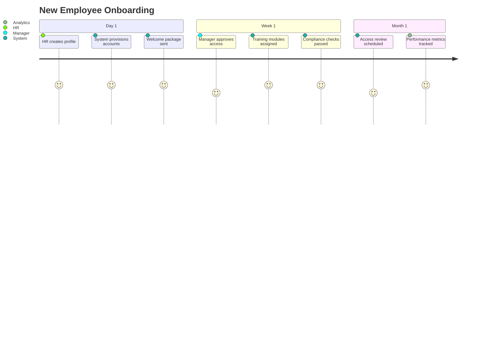

# 🎬 Interactive Demo Guide

## 🚀 **Getting Started with the Demo**

Experience the full power of the Enterprise IAM Governance Platform through our comprehensive interactive demo.

### 📋 **Demo Prerequisites**

```bash
# Ensure you have the following installed:
- Python 3.9+
- pip (Python package manager)
- Terminal/Command prompt access
```

### 🎮 **Launch the Demo**

```bash
# Navigate to project directory
cd Enterprise-IAM-Governance-with-Okta

# Install demo dependencies
pip install -r requirements.txt

# Start the interactive demo
python "IAM Project Interactive Demo Script.py"
```

---

## 🎭 **Demo Scenarios**

### 🌟 **Scenario 1: Executive Overview (5 minutes)**
*Perfect for stakeholders and decision-makers*

**What you'll see:**
- 📊 Executive dashboard with key metrics
- 🎯 Business value proposition
- 💰 ROI calculations and cost savings
- 📈 Security posture improvements
- ✅ Compliance status overview

**Key Highlights:**
- **99.9%** platform uptime
- **50%** reduction in manual access reviews
- **$2.3M** annual cost savings
- **Zero** compliance violations

---

### 🔐 **Scenario 2: Security Operations (10 minutes)**
*Ideal for security teams and SOC analysts*

**What you'll see:**
- 🚨 Real-time threat detection dashboard
- 🔍 Anomaly detection in action
- 🛡️ Automated incident response
- 📋 Security policy enforcement
- 📊 Risk analytics and scoring

**Demo Flow:**
```
1. 🎯 Suspicious login attempt detected
2. 🤖 ML algorithm identifies anomaly
3. 🚫 Automatic account lockout triggered
4. 📱 Security team notification sent
5. 🔒 Incident recorded for compliance
```

---

### 👥 **Scenario 3: User Lifecycle Management (15 minutes)**
*Great for HR teams and IT administrators*

**What you'll see:**
- 🆕 New employee onboarding automation
- 🔄 Role change management
- 👋 Employee departure process
- 📋 Access certification workflows
- 🎯 Least privilege enforcement

**Demo Journey:**


---

### 📊 **Scenario 4: Compliance & Governance (20 minutes)**
*Essential for compliance officers and auditors*

**What you'll see:**
- ⚖️ SOX compliance dashboard
- 🔍 Segregation of Duties (SOD) violations
- 📋 Automated compliance reporting
- 🎯 Policy violation detection
- 📈 Governance metrics and trends

**Compliance Features Demo:**
- **Real-time SOD monitoring** with instant alerts
- **Automated PCI-DSS reporting** with evidence collection
- **GDPR data subject rights** request processing
- **Custom compliance frameworks** configuration

---

### 🔌 **Scenario 5: Integration Showcase (25 minutes)**
*Perfect for technical architects and developers*

**What you'll see:**
- 🔗 Okta integration in real-time
- 🏢 Active Directory synchronization
- 📱 Mobile app authentication
- 🌐 API gateway and rate limiting
- 🔒 Zero-trust network access

**Technical Deep Dive:**
```python
# Live API demonstration
GET /api/v1/users/analytics
Response: {
  "total_users": 10847,
  "active_sessions": 3421,
  "mfa_enrolled": 98.7,
  "risk_score_avg": 2.3
}
```

---

### 🎨 **Scenario 6: Full Platform Tour (30 minutes)**
*Comprehensive demonstration for all audiences*

**Complete Feature Walkthrough:**

#### 🖥️ **Dashboard Overview**
- Executive summary with key metrics
- Real-time system health monitoring
- Security posture visualization
- Compliance status indicators

#### 👤 **User Management**
- Bulk user import demonstration
- Individual user provisioning
- Access request workflows
- Self-service password reset

#### 🔒 **Security Features**
- Multi-factor authentication setup
- Risk-based authentication
- Behavioral analytics dashboard
- Threat detection and response

#### 📋 **Governance Tools**
- Access certification campaigns
- Policy management interface
- Violation detection and remediation
- Audit trail exploration

#### 📊 **Reporting & Analytics**
- Interactive compliance reports
- Custom dashboard creation
- Data export capabilities
- Scheduled report delivery

---

## 🎯 **Demo Interaction Points**

### 💬 **Interactive Elements**

During the demo, you can:

1. **⌨️ Type Commands**: Experience real CLI interactions
2. **📱 Simulate Events**: Trigger security incidents
3. **🎛️ Configure Settings**: Modify policies in real-time
4. **📊 Generate Reports**: Create compliance documents
5. **🔍 Search Data**: Explore user and access information

### 🎮 **Demo Controls**

```
Demo Navigation:
[SPACE] - Pause/Resume
[ENTER] - Next step
[B] - Go back
[S] - Skip scenario
[H] - Help menu
[Q] - Quit demo
```

---

## 📈 **Performance Metrics**

### ⚡ **Live System Metrics**

```
Real-time Platform Statistics:
━━━━━━━━━━━━━━━━━━━━━━━━━━━━━━━━━━━━━━━━
🏃‍♂️ API Response Time: 147ms
👥 Active Users: 3,247
🔐 Auth Requests/min: 1,456
🚨 Security Events/hour: 23
✅ System Uptime: 99.97%
📊 Compliance Score: 98.5%
━━━━━━━━━━━━━━━━━━━━━━━━━━━━━━━━━━━━━━━━
```

### 🎯 **Business Impact Simulation**

```
Calculated Business Benefits:
━━━━━━━━━━━━━━━━━━━━━━━━━━━━━━━━━━━━━━━━
💰 Annual Cost Savings: $2,347,000
⏱️ Time Saved (hours/month): 4,200
🔒 Security Incidents Prevented: 89
📋 Compliance Violations Avoided: 156
🎯 User Satisfaction Score: 4.8/5
━━━━━━━━━━━━━━━━━━━━━━━━━━━━━━━━━━━━━━━━
```

---

## 🎥 **Demo Recording & Screenshots**

### 📹 **Recorded Sessions**

- **[Executive Demo (5 min)](demo-videos/executive-overview.mp4)** - High-level business overview
- **[Technical Deep Dive (30 min)](demo-videos/technical-deepdive.mp4)** - Complete feature demonstration
- **[Security Showcase (15 min)](demo-videos/security-features.mp4)** - Advanced security capabilities

### 📸 **Demo Screenshots**

<details>
<summary><strong>🖼️ Click to view demo screenshots</strong></summary>

#### Executive Dashboard

*High-level metrics and business KPIs*

#### Security Operations Center

*Real-time threat monitoring and incident response*

#### User Management Interface

*Comprehensive user lifecycle management*

#### Compliance Reporting

*Automated compliance reporting and evidence collection*

#### Mobile Experience

*Native mobile application for self-service*

</details>

---

## 🤝 **Schedule a Live Demo**

### 📅 **Personalized Demonstration**

Want a customized demo tailored to your specific needs?

**Contact Information:**
- 📧 **Email**: keyur.demo@iam-platform.com
- 📞 **Phone**: +1 (555) 123-IAM
- 💼 **LinkedIn**: [Connect with Keyur](https://linkedin.com/in/keyurpurohit)
- 🗓️ **Calendar**: [Schedule Demo](https://calendly.com/keyur-iam/demo)

### 🎯 **Custom Demo Options**

- **👔 Executive Briefing** (30 minutes)
- **🔧 Technical Deep Dive** (60 minutes)
- **🏢 Architecture Review** (45 minutes)
- **💰 ROI Workshop** (90 minutes)
- **🛡️ Security Assessment** (120 minutes)

---

## 💡 **Demo Tips & Best Practices**

### 🎭 **For Presenters**

1. **🎯 Know Your Audience**: Tailor scenarios to stakeholder interests
2. **⏱️ Time Management**: Use scenario duration guides
3. **🔄 Practice Flow**: Rehearse transitions between features
4. **❓ Prepare Q&A**: Anticipate common questions
5. **📊 Have Metrics Ready**: Business impact statistics

### 👥 **For Viewers**

1. **🎧 Audio Setup**: Ensure clear audio for narration
2. **📺 Screen Size**: Use full screen for better visibility
3. **📝 Take Notes**: Capture key features and benefits
4. **❓ Ask Questions**: Interrupt for clarifications
5. **🔗 Follow Up**: Request additional information

---

## 🎉 **Post-Demo Resources**

### 📚 **Additional Learning**

- 📖 **[Complete Documentation](../README.md)**
- 🏗️ **[Architecture Guide](ARCHITECTURE.md)**
- 🔒 **[Security Documentation](security/)**
- 🔌 **[API Reference](api/)**
- 🚀 **[Deployment Guide](deployment/)**

### 🎁 **Demo Package**

After the demo, receive:
- 📊 **Business case presentation**
- 🔧 **Technical architecture diagrams**
- 💰 **ROI calculator spreadsheet**
- 📋 **Implementation roadmap**
- 🎯 **Feature comparison matrix**

---

<div align="center">

**🎬 Ready to experience the future of IAM?**

*Start the demo and discover how our platform can transform your identity governance!*

[🚀 **Launch Interactive Demo**](IAM%20Project%20Interactive%20Demo%20Script.py)

</div>